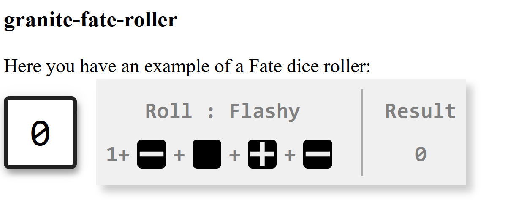

# granite-fate-roller

A Fate dice roller



## Using `granite-fate-roller`

To use *granite-fate-roller* in an element:


### 1. Install `granite-fate-roller`


Install the component using [npm](https://www.npmjs.com/):

```sh
$ npm i @granite-elements/granite-fate-roller
```


### 2. Import *granite-fate-roller* in the element where you want to use it


Once installed, import it in your application. Usually you will simply want to import `granite-fate-roller.js` (wrap around `spectre.css`) or `granite-fate-roller-min.js` (wrap around `spectre.min.css`).

Supposing you want to import `granite-fate-roller.js`:
 
```
import {spectreStyles} from '@granite-elements/granite-fate-roller/granite-fate-roller.js';
``` 

### 3. Use the \<granite-fate-roller> tag in your HTML


```html
<granite-fate-roller skill="Flashy" bonus="2"></granite-fate-roller>
```

## Contributing

1. Fork it!
2. Create your feature branch: `git checkout -b my-new-feature`
3. Commit your changes: `git commit -m 'Add some feature'`
4. Push to the branch: `git push origin my-new-feature`
5. Submit a pull request :D

## License

[MIT License](http://opensource.org/licenses/MIT)